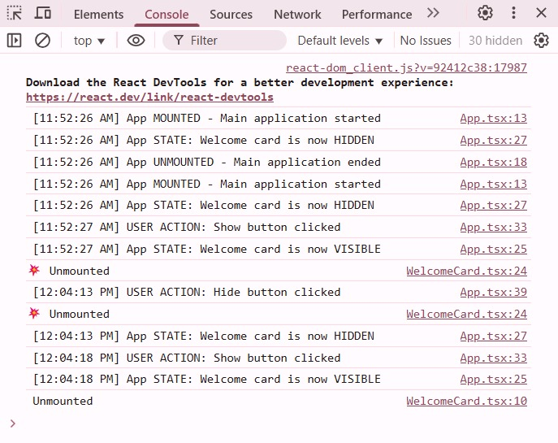

<p align="center">
  
</p>

# 🌌 Cosmic Explorer

A magical and animated **React + TypeScript** app that showcases component lifecycles using visual UI + cosmic elements like **Three.js**, glowing stars, fog, orbiting particles, and parallax movement. Built with **Tailwind CSS**, it’s the perfect canvas for learning and creativity. 🌠

---

## 🚀 Live Demo

[](https://your-demo-link.com)
[](https://github.com/SanyaShresta25/space-welcome)

---

## 📸 Preview
<p align="center">
  
</p>
<p align="center">
  
</p>

---

## 🛠️ Built With

[](https://react.dev)
[](https://www.typescriptlang.org/)
[](https://tailwindcss.com/)
[](https://threejs.org/)

---

## ✨ Features

* 🪐 Animated starfield and orbiting particles using Three.js
* 🌫️ Magical fog and glowing background
* 🚀 Show/Hide Welcome Card with lifecycle logging
* 🔄 Console logs for `mounted`, `updated`, and `unmounted`
* 🎨 Parallax effect using mouse movement
* 🌌 Dreamy glassmorphic UI and floating elements

---

## 🔍 useEffect Usage

| File              | Purpose                                  |
|-------------------|------------------------------------------|
| `WelcomeCard.tsx` | Logs `mounted`, `updated`, `unmounted`   |
| `App.tsx`         | Tracks `App` mounting/unmounting         |
| `SpaceBackground.tsx` | Manages Three.js lifecycle and resize |

---

## 🔧 Getting Started

```bash
# Clone the repo
git clone https://github.com/SanyaShresta25/starlit-useeffect-demo.git
cd starlit-useeffect-demo

# Install dependencies
npm install

# Run the development server
npm run dev
```

---
## 📚 Useful References

* [React – useEffect](https://react.dev/reference/react/useEffect)
* [Three.js Docs](https://threejs.org/docs/)
* [Tailwind CSS Blur Utilities](https://tailwindcss.com/docs/blur)
* [TypeScript + React Guide](https://react-typescript-cheatsheet.netlify.app/)

---

## 👩‍🚀 Author

**Sanya Shresta Jathanna**

[](https://github.com/SanyaShresta25)
[](https://www.linkedin.com/in/sanya-shresta-jathanna)
[](https://sanyashresta.netlify.app/)

---

## 🙏 Acknowledgments

* To the cosmos and the stars that inspired this visual
* To React and Three.js for making magic in the browser possible
